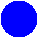
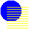
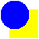
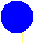
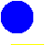
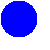
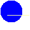

# JSegue

A Java library of animated image-to-image transitions useful for slide shows, photo montages, UI transitions and the like.

[](https://travis-ci.org/defano/jsegue)

## Features

* 23 animations for transitioning one image to another including cross-dissolve, wipe, scroll, zoom, and checkerboard effects. May be used to generate realtime animations or to render frames offline (in batch).
* May substitute a `Paint` for either source or destination image for effects like fade-to-black.
* Configurable animation duration, frames-per-second and alpha blending.
* Simple to use and integrate; lightweight library with no transitive dependencies.

## Segues

| Effect | Name           | Description
|-|-----------------------|--------------------------
|| `DISSOLVE`            | Cross-dissolve from source to destination.
|| `CHECKERBOARD`        | Destination image appears over the source in a 8x8 matrix.
|| `VENETIAN_BLINDS`     | Destination appears in "louvered" horizontal stripes.
|| `SCROLL_LEFT`         | Scroll from right to left.
|| `SCROLL_RIGHT`        | Scroll from left to right.
|| `SCROLL_UP`           | Scroll from bottom to top.
|| `SCROLL_DOWN`         | Scroll from top to bottom.
|| `WIPE_LEFT`           | Slides the destination image over the source from right to left.
|| `WIPE_RIGHT`          | Slides the destination image over the source from left to right.
|| `WIPE_UP`             | Slides the destination image over the source from bottom to top.
|| `WIPE_DOWN`           | Slides the destination image over the source from top to bottom.
|| `ZOOM_OUT`            | The destination image expands over the source in a rectangle aperture.
|| `ZOOM_IN`             | The source image collapses over the destination in a rectangle aperture.
|| `IRIS_OPEN`           | The destination image expands over the source in a circular aperture.
|| `IRIS_CLOSE`          | The source image collapses over the destination in a circular aperture.
|| `BARN_DOOR_OPEN`      | The source image is split horizontally and each side slides out left/right to expose the destination.
|| `BARN_DOOR_CLOSE`     | The destination image slides in the from the left/right obscuring the source image.
|| `SHRINK_TO_BOTTOM`    | The source image shrinks downward exposing the destination.
|| `SHRINK_TO_TOP`       | The source image shrinks upward exposing the destination.
|| `SHRINK_TO_CENTER`    | The source image shrinks from the center of the screen exposing the destination.
|| `STRETCH_FROM_BOTTOM` | The destination image grows from the bottom obscuring the source underneath it.
|| `STRETCH_FROM_TOP`    | The destination image grows from the top obscuring the source underneath it.
|| `STRETCH_FROM_CENTER` | The destination image grows from the center of the screen obscuring the source underneath it.
|| `PLAIN`               | A no-op transition that simply renders the source image.

## Getting Started

#### 1. Install the library:

JSegue is published to Maven Central; include the library in your Maven project's POM, like:

```
<dependency>
    <groupId>com.defano.jsegue</groupId>
    <artifactId>jsegue</artifactId>
    <version>0.0.1</version>
</dependency>
```

... or your Gradle build script:

```
repositories {
	mavenCentral()
}

dependencies {
  compile 'com.defano.jsegue:jsegue:0.0.1'
}
```

#### 2. Make your class react to animation changes:

As your animation runs, JSegue will notify you that a new animation frame is ready to be displayed. Typically you'll place this image into some component visible to the user:

```
public class MyClass implements SegueAnimationObserver {

  private JLabel myDisplay;

  ...

  @Override
  void onFrameRendered(AnimatedSegue segue, BufferedImage image) {
    myDisplay.setIcon(new ImageIcon(image));
  }  

}
```

#### 3. Build an animation:

```
  BufferedImage mySource = ... ;
  BufferedImage myDestination = ... ;

  // Create a cross-dissolve segue
  AnimatedSegue mySegue = SegueBuilder.of(SegueName.DISSOLVE)
    .withSource(mySource)
    .withDestination(myDestination)
    .withDuration(1500, TimeUnit.MILLISECONDS)      // Animation lasts 1.5 seconds
    .withMaxFramesPerSecond(30)                     // No more than 30fps
    .withAnimationObserver(this)                    // Make this class an observer
    .alphaBlend(true)                               // Overlay images; see FAQs
    .build()

  // Kick it off...
  mySegue.start();

```

## Frequently Asked Questions

#### How do I fade-to-black or animate the appearance of a single image?

Use the `Paint` form of the `withSource()` and `withDestination()` methods in the builder.

For example, to fade an image to black:

```
SegueBuilder.of(SegueName.DISSOLVE)
  .withSource(myImage)
  .withDestination(Color.BLACK)
  ...
  .build();
```

Or, to make an image appear using a zoom effect:

```
SegueBuilder.of(SegueName.ZOOM_IN)
  .withSource(new Color(0, 0, 0, 0))     // Transparent color
  .withDestination(myImage)
  ...
  .build();
```

#### What does the `overlay` option do?

First, it has no effect if both images contain no areas of translucency. Otherwise, when true, the source and destination images will be alpha composited together. When false, the destination image is generally treated as fully opaque; the bounds of the destination will obscure the the other as the animation progresses. The exact impact of this property differs across segue animations and has no affect at all on some.

Which looks best is a matter of preference (as well as the composition of the source and destination images). Note that the animations shown in the table above were created with overlay on.

#### Do my source and destination images have to be the same size?

Kinda. The `AnimatedSegue` objects expect the source and destination images to be the same size. So if you create these objects yourself (or invoke the render() method directly), you'll need assure both source and destination images are the same size.

However, if you create a segue using `SegueBuilder`, the builder will automatically resize the image(s) to the largest dimensions.

#### Can I chain animations together or have more than two images participate in a segue?

Yes, but... This library does not manage segue sequences for you. But you can achieve this effect by registering yourself as an observer of animation completion. At the completion of each segue you can immediate start the next one in your sequence.

```
SegueBuilder.of(SegueName.ZOOM_IN)
  .withSource(new Color(0, 0, 0, 0))    // Fully transparent
  .withDestination(myImage)
  .withCompletionObserver(segue -> startNextSegueInSequence())
  ...
  .build();
```
